# CRM Digital FTE Factory

**GIAIC Hackathon 5 — Production AI Customer Success Agent**


---

## What is This?

**CRM Digital FTE Factory** is a production-grade AI Customer Success agent for **NexaFlow** — a B2B SaaS workflow automation platform. The AI acts as a full-time employee (FTE), autonomously handling ~800 support tickets/week across **3 channels** with a 75% AI resolution rate — no human needed for most tickets.

---

## Architecture

```
┌─────────────┐   ┌──────────────┐   ┌──────────────────┐
│   Gmail      │   │  WhatsApp    │   │  Next.js Web Form │
│  (Email)     │   │  (Twilio)    │   │  (3-step form)   │
└──────┬───────┘   └──────┬───────┘   └────────┬─────────┘
       │                  │                    │
       └──────────────────┼────────────────────┘
                          │
                   ┌──────▼──────┐
                   │    Kafka     │  ← Confluent Cloud
                   │  (Queue)     │
                   └──────┬───────┘
                          │
                   ┌──────▼──────────────────────┐
                   │   FastAPI Orchestration      │
                   │   + OpenAI Agents SDK        │
                   │   + 7 tools (KB, escalation) │
                   └──────┬───────────────────────┘
                          │
              ┌───────────┼───────────┐
              │                       │
     ┌────────▼──────┐   ┌────────────▼────────┐
     │  Neon          │   │  Human Escalation    │
     │  PostgreSQL    │   │  (Mon-Fri 9-6 PKT)   │
     │  + pgvector    │   └─────────────────────┘
     └───────────────┘
```

---

## What's Built

### 3-Channel AI Customer Support (All Verified Working)

| Channel | Status | How to test |
|---------|--------|-------------|
| 🌐 Web Form | ✅ Live | Go to `/support` → submit ticket → AI responds in ~30s |
| 💬 WhatsApp | ✅ Live | Message **+1 415 523 8886** → AI responds on your phone |
| 📧 Gmail | ✅ Live | Email `mmfake78@gmail.com` → AI replies to your inbox |
| 🤖 Chat Widget | ✅ Live | Click blue bot icon (bottom-right) → instant Q&A |

### Admin Features

- 🔐 **Role-based auth** (admin/agent) — NextAuth.js v5 + bcrypt
- 📊 **Admin dashboard** — all tickets, metrics, channel breakdown
- 👤 **Staff management** — create agent accounts from dashboard
- 💬 **Agent reply box** — reply to escalated tickets; reply sent back via original channel
- 📱 **Escalation alerts** — admin gets WhatsApp 🚨 when ticket is escalated

### AI Capabilities

- OpenAI Agents SDK (gpt-4o-mini), 7 tools
- RAG with pgvector — searches NexaFlow knowledge base (11 chunks)
- Multilingual — detects Urdu/English, responds in same language
- Sentiment analysis — escalates angry/complex tickets automatically
- Prompt injection protection — refuses jailbreak attempts
- 24/7 autonomous operation on HF Spaces

---

## Tech Stack

| Layer | Technology |
|-------|-----------|
| Frontend | Next.js 16, TypeScript, Tailwind CSS, shadcn/ui |
| Backend | FastAPI, Python 3.12 |
| AI Agent | OpenAI Agents SDK, gpt-4o-mini |
| Database | Neon PostgreSQL + pgvector |
| Message Queue | Apache Kafka (Confluent Cloud) |
| Channels | Gmail API (OAuth2), Twilio WhatsApp, Web Form |
| Auth | NextAuth.js v5, JWT, RBAC |
| Deployment | Vercel (frontend) + HF Spaces (backend) |
| Containers | Docker + Kubernetes manifests |

---

## Quick Start

```bash
# 1. Clone
git clone https://github.com/Psqasim/crm-digital-fte.git && cd crm-digital-fte

# 2. Python setup
python3 -m venv .venv && source .venv/bin/activate
pip install -r requirements.txt -r production/requirements.txt

# 3. Environment
cp .env.example .env   # fill in DATABASE_URL + OPENAI_API_KEY at minimum

# 4. Start FastAPI
uvicorn production.api.main:app --reload --port 8000

# 5. Verify
curl http://localhost:8000/health
```

Full setup instructions → [docs/setup/setup.md](docs/setup/setup.md)

---

## Live Demo

| | URL |
|-|-----|
| **Frontend** | https://crm-digital-fte-two.vercel.app |
| **Backend API** | https://psqasim-crm-digital-fte-api.hf.space |
| **Health check** | https://psqasim-crm-digital-fte-api.hf.space/health |
| **Video Demo** | https://www.youtube.com/watch?v=5Jk2zpKcOYU |

### Test Credentials
```
Admin:  admin@nexaflow.com / Admin123!
```

### What to try
1. Submit a support ticket via **Get Support** — watch it auto-resolve in ~30 seconds
2. Click the **blue bot icon** (bottom-right) to open the AI chat widget
3. Ask the chat: *"What integrations does NexaFlow support?"*
4. Ask in Urdu: *"NexaFlow کیا ہے؟"* — response comes back in Urdu
5. Login as admin to see all tickets, metrics, and staff management

---

## Project Structure

```
crm-digital-fte/
├── context/              # NexaFlow company + product docs
├── docs/                 # Documentation
│   ├── README.md         # Docs index
│   ├── setup/            # Setup guide
│   ├── env/              # Environment variables
│   ├── api/              # API reference
│   ├── deploy/           # Deployment guide
│   └── web-form/         # Web form integration
├── production/
│   ├── agent/            # AI agent (OpenAI Agents SDK)
│   ├── api/              # FastAPI app + routes
│   ├── channels/         # Gmail, WhatsApp, Web Form handlers
│   ├── database/         # Schema, queries, seed script
│   ├── kafka/            # Kafka consumer
│   ├── monitoring/       # Metrics + alerts
│   ├── tests/            # Production + E2E tests
│   ├── workers/          # Background workers
│   ├── k8s/              # Kubernetes manifests
│   └── docker-compose.yml
├── src/
│   ├── agent/            # Core agent models + prototype
│   └── web-form/         # Next.js 15 frontend
├── specs/                # Spec-Kit Plus specs per phase
├── tests/                # Unit tests
└── LICENSE
```

---

## Screenshots

| | |
|---|---|
| 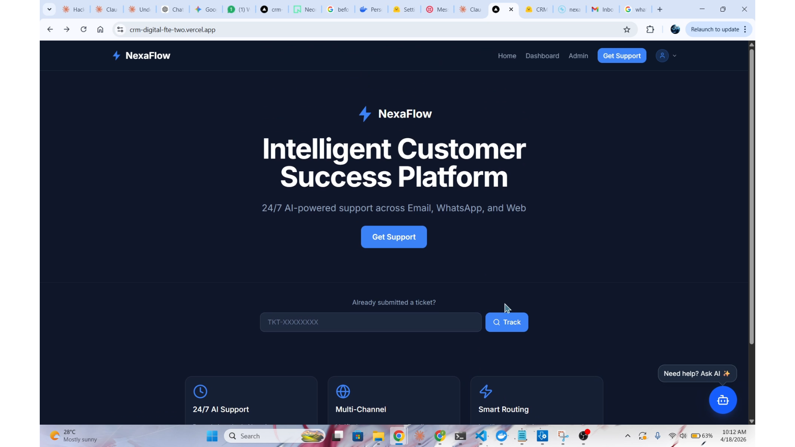 | 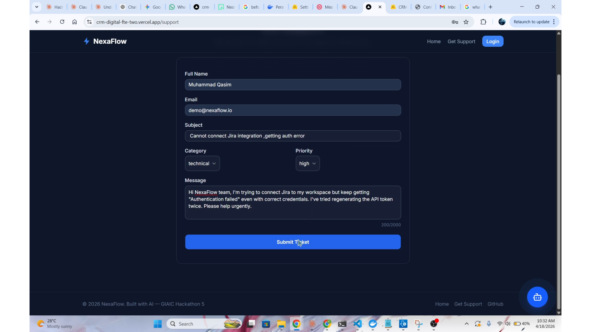 |
| Landing Page | Support Form |
| 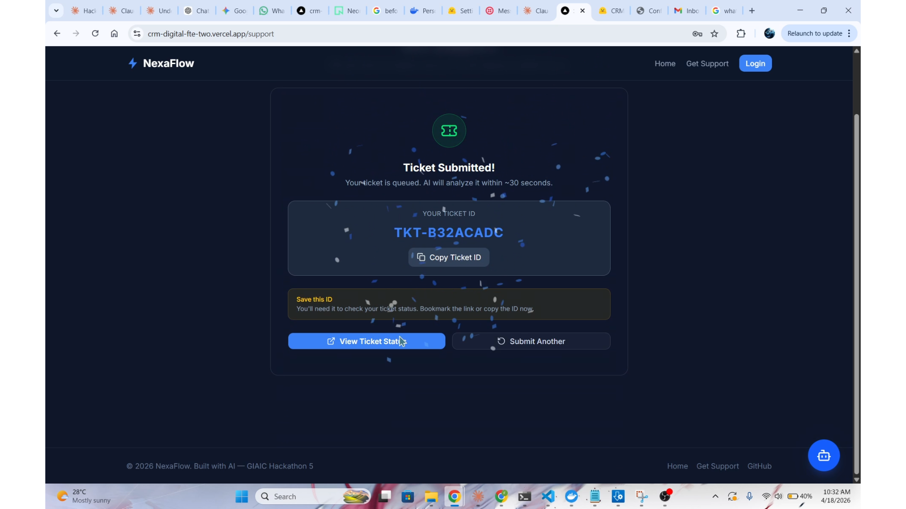 | 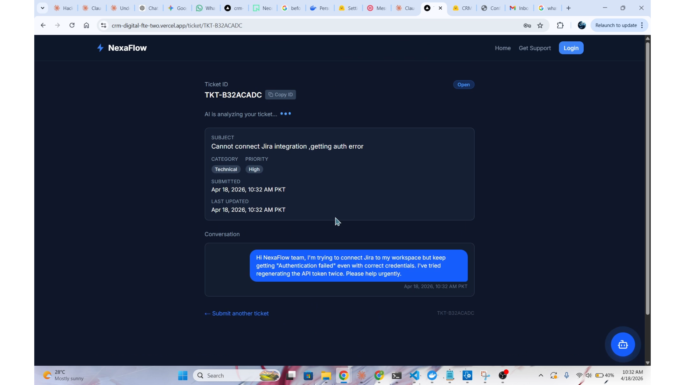 |
| Ticket Submitted — TKT ID | AI Analyzing Ticket |
| 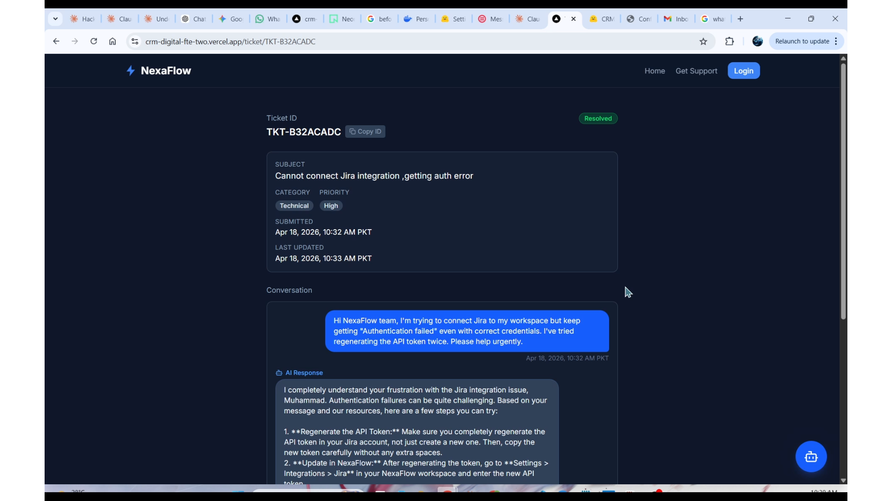 | 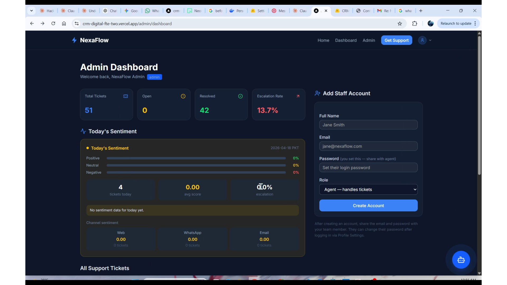 |
| AI Resolved — No Human | Admin Dashboard |
| 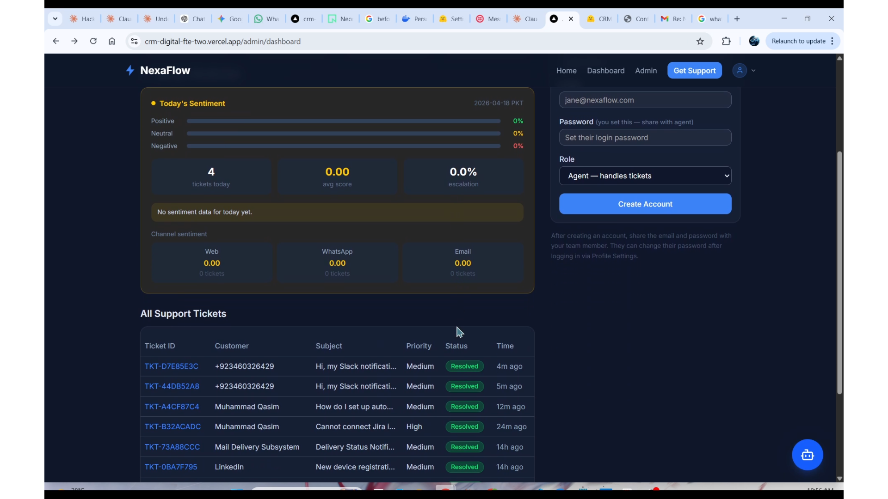 | 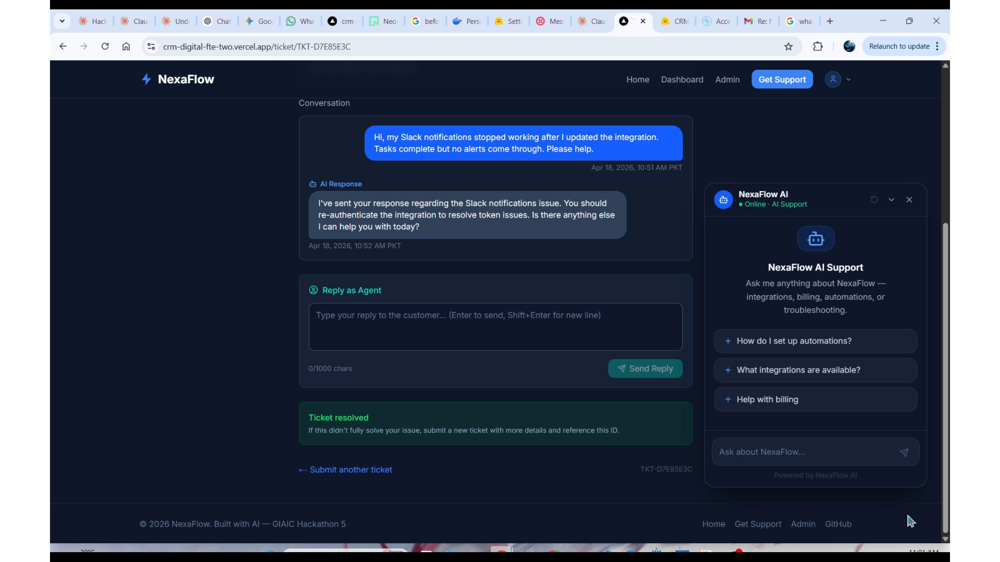 |
| My Tickets Dashboard | AI Chat Widget |
| 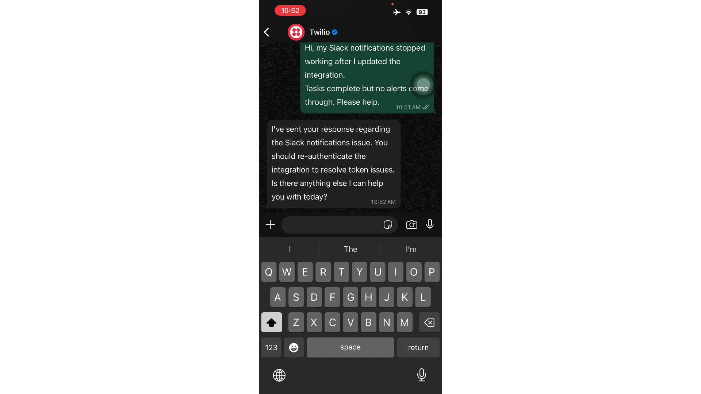 | 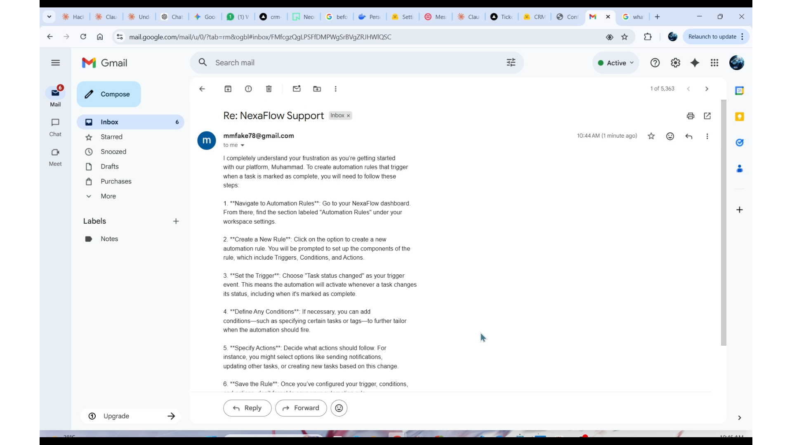 |
| WhatsApp Channel — Live | Gmail Channel — Live |
| 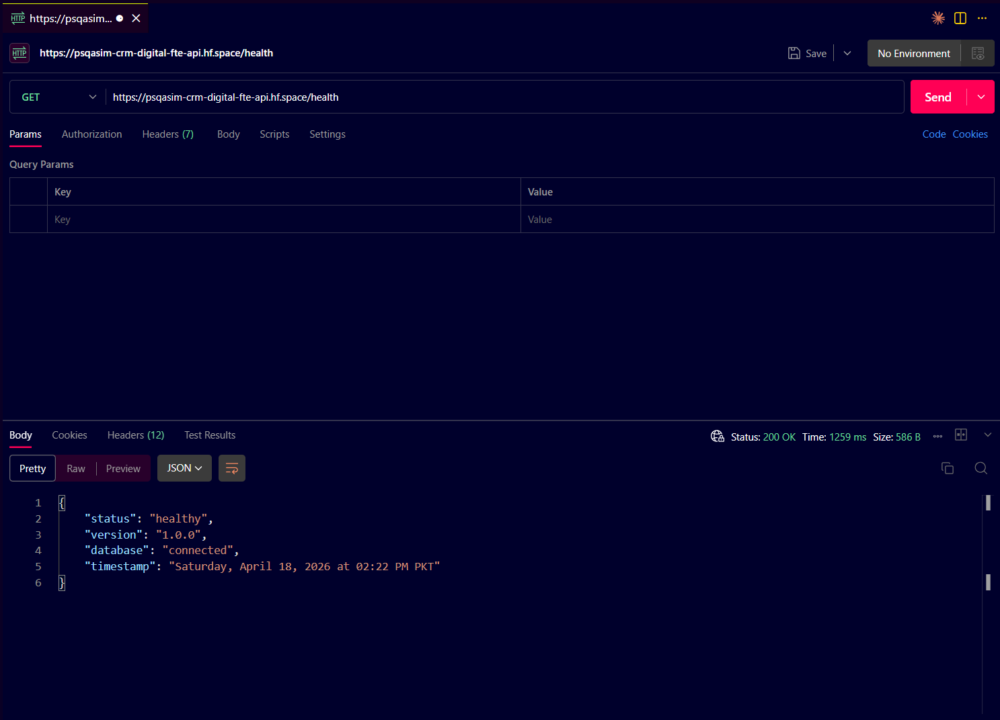 | |
| Backend Health Check | |

---

## Documentation

Full docs in [`docs/`](docs/README.md):

| Guide | Link |
|-------|------|
| Setup | [docs/setup/setup.md](docs/setup/setup.md) |
| Env Variables | [docs/env/env.md](docs/env/env.md) |
| API Reference | [docs/api/api.md](docs/api/api.md) |
| Deployment | [docs/deploy/deployment.md](docs/deploy/deployment.md) |
| Web Form | [docs/web-form/README.md](docs/web-form/README.md) |

---

## Tests

```bash
# 165+ unit + integration tests
pytest tests/ production/tests/ -v --ignore=production/tests/test_e2e.py

# E2E tests (requires running server + DB)
TEST_DATABASE_URL="..." pytest production/tests/test_e2e.py -v
```

---

## License

[MIT](LICENSE) — Muhammad Qasim, 2026
